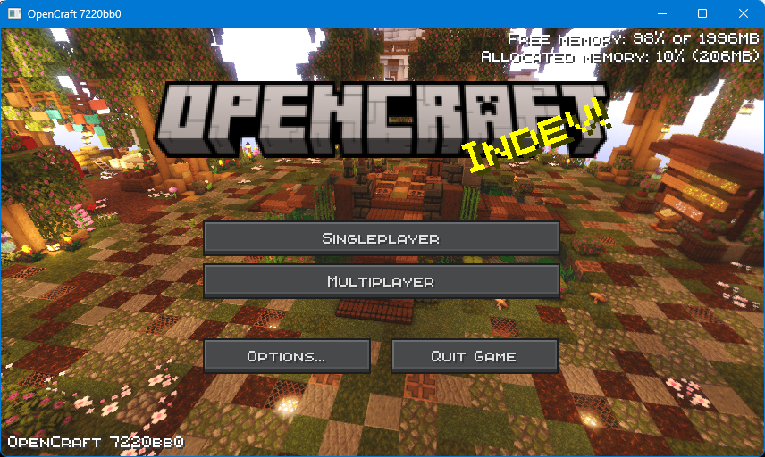
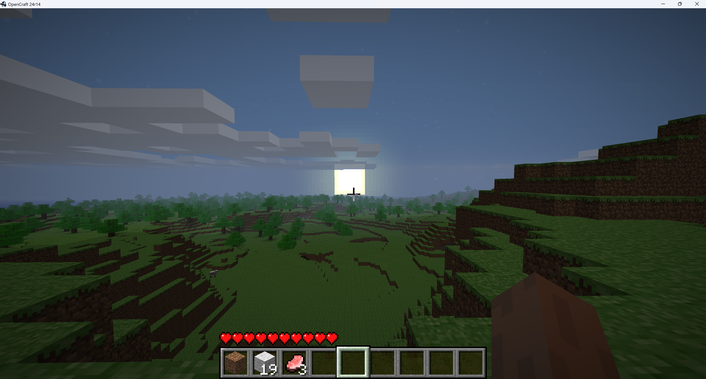

<div align="center">

[![Contributors][contributors-shield]][contributors-url]
[![Forks][forks-shield]][forks-url]
[![Stargazers][stars-shield]][stars-url]
[![Issues][issues-shield]][issues-url]
[![MPL License][license-shield]][license-url]

</div>

<br /><br />
<div align="center">
  <a href="https://github.com/OpenCraft-Studios/OpenCraft">
    
  </a>

  <h3 align="center">OpenCraft</h3>

  <p align="center">
    A roughly calculated clone of Minecraft
    <br /><br />
    <a href="https://github.com/OpenCraft-Studios/OpenCraft/wiki">
      <b>Explore the docs »</b>
    </a>
    <br />
    <a href="https://github.com/OpenCraft-Studios/OpenCraft/issues">
      Report Bugs
    </a>
    ·
    <a href="#-downloading">
      Download
    </a>
    ·
    <a href="https://github.com/OpenCraft-Studios/OpenCraft/pulls">
      Feature Request
    </a>
  </p>
</div>

<br />

> [!WARNING]
> This project **IS NOT** affiliated with Mojang or other minecraft product. <br />
> This is just a hobby and I do not take care of any uses provided to this utility.

> ```FOR SUPPORT:``` https://github.com/OpenCraft-Studios/OpenCraft/issues/ <br />
> ```FOR CONTRIBUTING:``` https://github.com/OpenCraft-Studios/OpenCraft/pulls

<br />

## ✅ Getting started
**OpenCraft** is a game programmed in Java, it has the same motor (LWJGL 2 + Java 17) that Minecraft.

### Why this project? 🤔
> I created this project because Minecraft is closed-source. I know that you can decompile it, but modification
> and redistribution of a modified copy of Minecraft is actually illegal. So I created a clone of Minecraft that
> allows modification and redistribution.

I want to create a community around this project,
I hope that you can be part of that community forking the repository or simply, bring us a star :heart:

<details open>
  <summary>
    <h3>Screenshots</h3>
  </summary><br />
  <p align="center">
    &nbsp;
    
  </p>
<!--  <div align="center">
    
    <p><b>+6 languages</b></p>
  </div>-->
</details>

---

## ☕ Downloading
We already have prebuilt jars. They can be downloaded [here](https://github.com/OpenCraft-Studios/OpenCraft/actions).

###### Windows
```batch
java -cp OpenCraft.jar; net.opencraft.OpenCraft --gameDir opcraft
```

###### Bash
```bash
#!/bin/bash
java -cp OpenCraft.jar: net.opencraft.OpenCraft --gameDir opcraft/
```

---

## ⚖️ License

**You can:**
- Make modifications of this project. *(includes modifying texture, resources, classes,...)*
- Redistribute that modifications. *(without impersonating anyone)*
- Give yourself part of the credits. *(but giving most of the credits to the original authors)*
- Obfuscate **some parts** of the code to promote security. *(authentication purposes,...)*

---

**You must not:**
- Sell the game or its modifications.
- Change the license document.
- Put malware in the code of this repository or any forks of it.
- Impersonate authors of the project.

---

**You must:**
- Give credits to the original authors of this project.

---

**The full license is at [BSL 1.0][license-url].**

<br />


## 👷‍♂️ Contributors
| [](https://github.com/CiroZDP) | [](https://github.com/TheNicolasDeveloper) | 	 |
|:-----------------------------------------------------------------------------------------------:|:-----------------------------------------------------------------------------------------------:|:----------------------------------------------------------------------------------------------------:|
|                                           **CiroZDP**                                           |                                           **Nicolas**                                           |                                          **The community**                                           |

---

[contributors-shield]: https://img.shields.io/github/contributors/OpenCraft-Studios/OpenCraft.svg?style=for-the-badge
[contributors-url]: https://github.com/OpenCraft-Studios/OpenCraft/graphs/contributors
[forks-shield]: https://img.shields.io/github/forks/OpenCraft-Studios/OpenCraft.svg?style=for-the-badge
[forks-url]: https://github.com/OpenCraft-Studios/OpenCraft/network/members
[stars-shield]: https://img.shields.io/github/stars/OpenCraft-Studios/OpenCraft.svg?style=for-the-badge
[stars-url]: https://github.com/OpenCraft-Studios/OpenCraft/stargazers
[issues-shield]: https://img.shields.io/github/issues/OpenCraft-Studios/OpenCraft.svg?style=for-the-badge
[issues-url]: https://github.com/OpenCraft-Studios/OpenCraft/issues
[license-shield]: https://img.shields.io/github/license/OpenCraft-Studios/OpenCraft.svg?style=for-the-badge
[license-url]: https://github.com/OpenCraft-Studios/OpenCraft/blob/main/LICENSE.txt
