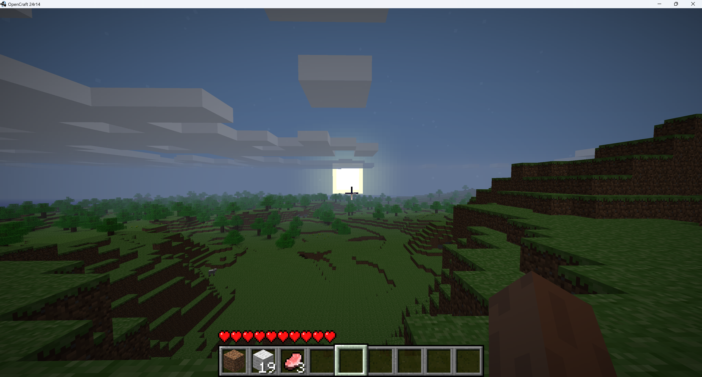
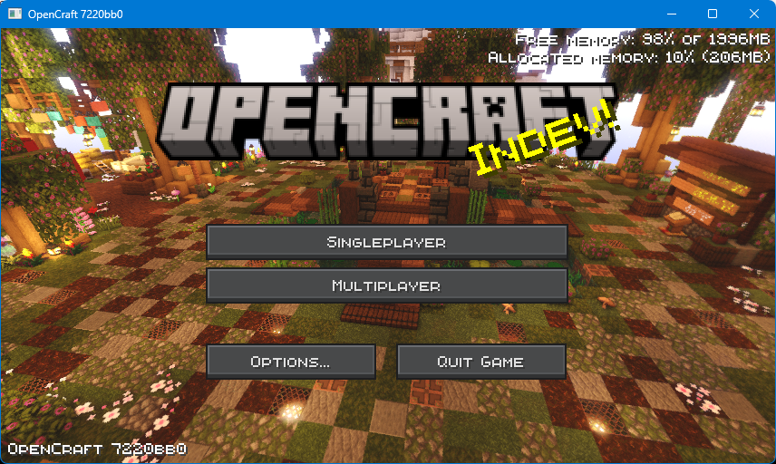

<br><br>
<div align="center">
  <a href="https://github.com/OpenCraft-Studios/OpenCraft">
    
  </a>

  <h3 align="center">OpenCraft</h3>

  <p align="center">
    A roughly calculated clone of Minecraft
    <br /><br />
    <a href="doc">
      <b>Documentation »</b>
    </a>
    <br />
    <a href="https://github.com/OpenCraft-Studios/OpenCraft/issues/new?assignees=&labels=&projects=&template=bug_report.md&title=">
      Report Bugs
    </a>
    ·
    <a href="#installing">
      Installing
    </a>
    ·
    <a href="https://github.com/OpenCraft-Studios/OpenCraft/issues/new?assignees=&labels=&projects=&template=feature_request.md&title=">
      Feature Request
    </a>
  </p>
</div>

<div align="center">

[![Contributors][contributors-shield]][contributors-url]
[![Forks][forks-shield]][forks-url]
[![Stargazers][stars-shield]][stars-url]
[![Issues][issues-shield]][issues-url]
[![MPL License][license-shield]][license-url]

</div>

## Introduction 📜
**OpenCraft** is a game programmed in Java, it uses the same technologies (LWJGL 2 + Java 21) as Minecraft.

### Warning ⚠️
This project **IS NOT** affiliated with Mojang, Microsoft, or any of their products.
This software is provided "as is", without warranty of any kind. See [license](#license).

### Why this project? 🤔
We want to create a game that incorporates Minecraft's voxel-based sandbox gameplay with an open codebase that
allows for easy modification and expansion.

Join our community by giving this repo a star 🌟 or forking it 🍴.

<details open>
  <summary>
    <h3>Screenshots</h3>
  </summary><br />
  <p align="center">
    
    
  </p>
  <div align="center">
    
  </div>
</details>

---

<h2 id="installing">🚀 Installing</h2>

### Windows Script 👨‍💻
Download [opencraft-windows.bat](https://github.com/OpenCraft-Studios/OpenCraft/releases/download/auto-release/opencraft-windows.bat)
and double click it!

### Download Jar ☕

Download [opencraft.jar](https://github.com/OpenCraft-Studios/OpenCraft/releases/download/auto-release/opencraft.jar) and enter this command:
```bash
java -jar opencraft.jar
```

### Build From Source 🛠️

```bash
git clone https://github.com/OpenCraft-Studios/OpenCraft
cd OpenCraft
mvn clean package
java -jar target/opencraft.jar
```

---

## ⚖️ License

**You can:**
- Make modifications of this project. *(includes modifying texture, resources, classes,...)*
- Redistribute that modifications. *(without impersonating anyone)*
- Give yourself part of the credits. *(but giving most of the credits to the original authors)*
- Obfuscate **some parts** of the code to promote security. *(authentication purposes,...)*

---

**You must not:**
- Sell the game or its modifications.
- Change the license document.
- Put malware in the code of this repository or any forks of it.
- Impersonate authors of the project.

---

**You must:**
- Give credits to the original authors of this project.

---

**The full license is at [BSL 1.0][license-url].**


[contributors-shield]: https://img.shields.io/github/contributors/OpenCraft-Studios/OpenCraft.svg?style=for-the-badge
[contributors-url]: https://github.com/OpenCraft-Studios/OpenCraft/graphs/contributors
[forks-shield]: https://img.shields.io/github/forks/OpenCraft-Studios/OpenCraft.svg?style=for-the-badge
[forks-url]: https://github.com/OpenCraft-Studios/OpenCraft/network/members
[stars-shield]: https://img.shields.io/github/stars/OpenCraft-Studios/OpenCraft.svg?style=for-the-badge
[stars-url]: https://github.com/OpenCraft-Studios/OpenCraft/stargazers
[issues-shield]: https://img.shields.io/github/issues/OpenCraft-Studios/OpenCraft.svg?style=for-the-badge
[issues-url]: https://github.com/OpenCraft-Studios/OpenCraft/issues
[license-shield]: https://img.shields.io/github/license/OpenCraft-Studios/OpenCraft.svg?style=for-the-badge
[license-url]: https://github.com/OpenCraft-Studios/OpenCraft/blob/main/LICENSE.txt
